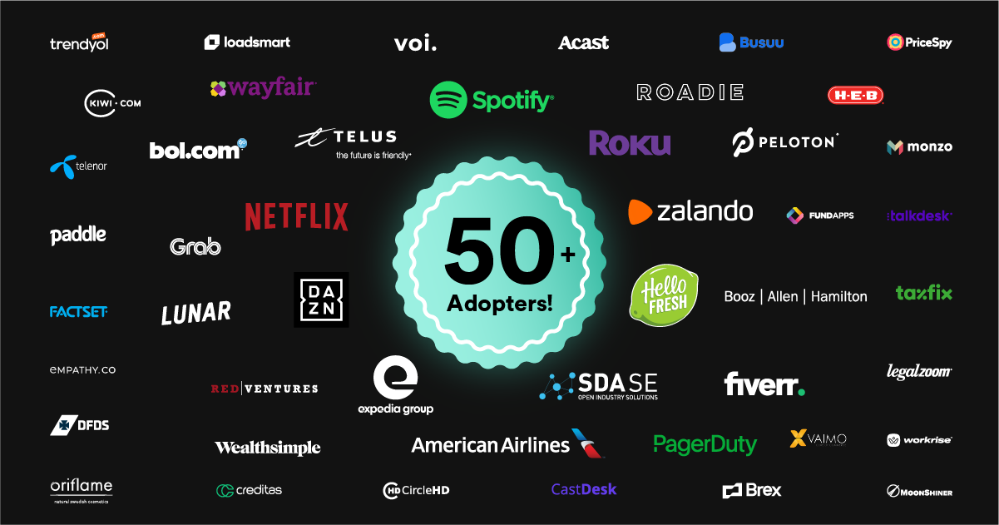
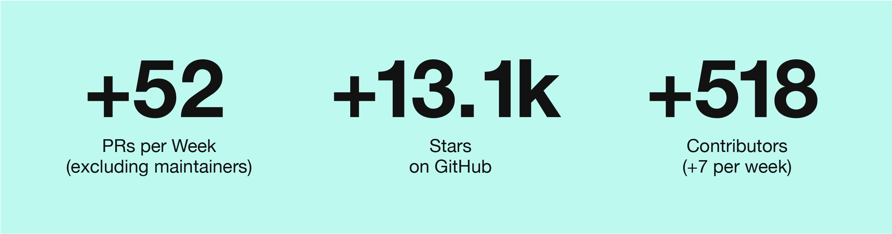

# Backstage.io Evaluation

## Who all are adopting Backstage

### Backstage Adopters:
As mentioned in a [Backstage Post on Sep 30, 2021](https://backstage.io/blog/2021/09/30/50-public-adopters), Backstage reached its important milestone: 50+ public adopters. 

List of adopters could be found at: https://github.com/backstage/backstage/blob/master/ADOPTERS.md

#### The growth from Github information (the number of contributors, PRs and rating):

More than 50 plugins in [Backstage Plugin Marketplace](https://backstage.io/plugins).

## What is current and future support

### Core Features  
- **Software Catalog (Alpha)**: The Backstage Software Catalog is a centralized system that keeps track of ownership and metadata for all the software in your ecosystem (services, websites, libraries, data pipelines, etc).  
- **Software Template (Beta)**: A tool that can help you create Components inside Backstage. By default, it has the ability to load skeletons of code, template in some variables, and then publish the template to some locations like GitHub or GitLab.  
- **TechDocs (Beta)**: Spotify’s homegrown docs-like-code solution built directly into Backstage. This means engineers write their documentation in Markdown files which live together with their code.  
- **Backstage Search (Alpha)** lets you find the right information you are looking for in the Backstage ecosystem.  
- **Kubernetes in Backstage** is a tool that's designed around the needs of service owners, not cluster admins. Now developers can easily check the health of their services no matter how or where those services are deployed — whether it's on a local host for testing or in production on dozens of clusters around the world.  

### Roadmap: https://backstage.io/docs/overview/roadmap

## References
https://raghavramesh.github.io/posts/spotify-backstage-evaluation/
https://www.thoughtworks.com/radar/platforms?blipid=202010066
